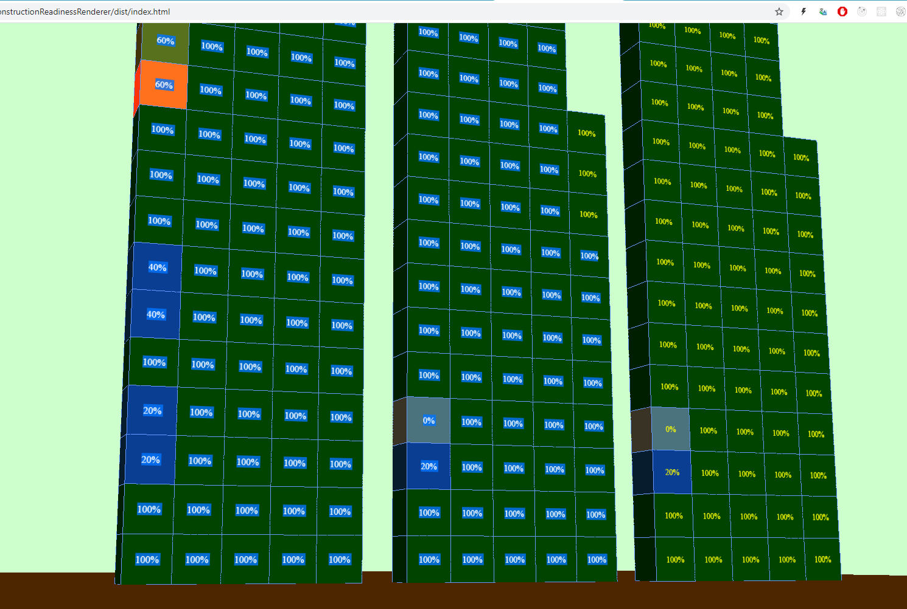

# constructionReadinessRenderer

Рендер символического многокорпусного здания по данным о степени готовности его элементов

## Оглавление

  * [Где увидеть работающий пример кода](#prototype_example)
  * [Пример вводных данных](#data_example)
  * [Как это примерно должно выглядеть](#visualization_example)
  * [Как это встраивать на страницу](#embedding_example)
  * [Как это обеспечить данными](#data_flow_example)

## <a name="prototype_example">Представление работающего кода будет тут:</a>

https://codepen.io/SergioBelevskij/pen/NWqrZJJ?editable=true

## <a name="data_example">Пример вводных данных:</a>

  образец JSON лежит [тут](./guide/jsonExample.md)

## <a name="visualization_example">Как это примерно должно выглядеть</a>

Для обзора используйте клавиши:

  * w - Движение вперёд;
  * s - Движение назад;
  * a - Движение влево;
  * d - Движение вправо;
  * Shift - Ускориться;
  * Space - Прыжок;
  * Левая кнопка мыши - переключение в режим управлением обзора;

## <a name="embedding_example">Как это встраивать на страницу</a>

  * Копируете HTML разметку из файла [dist/template.html](./dist/template.html) как строку;
  * Заменяете в строке сигнатуру `{jsonAnchor}` на свой json (`[{...}]`);
  * Вставляете в 1С документ;

  P.S. Позже данный код будет генерироваться автоматически и инструкция может измениться.

## <a name="data_flow_example">Как это обеспечить данными</a>
